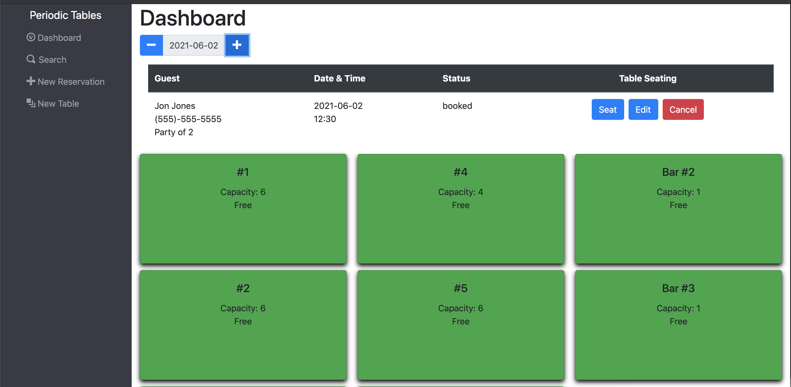
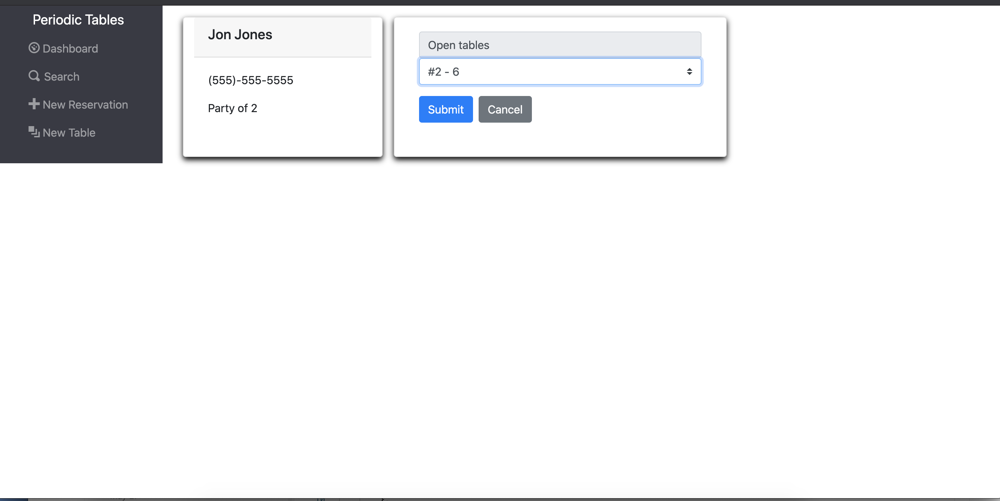
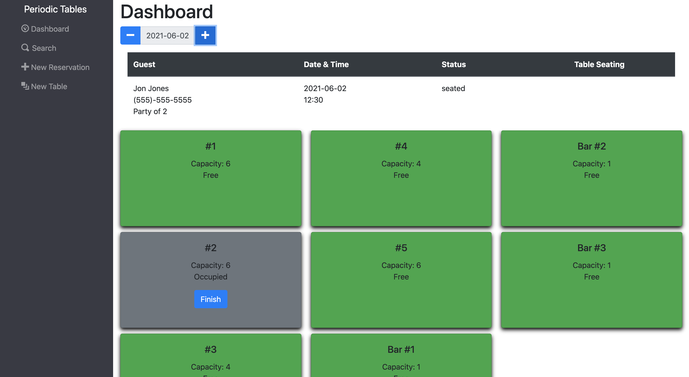
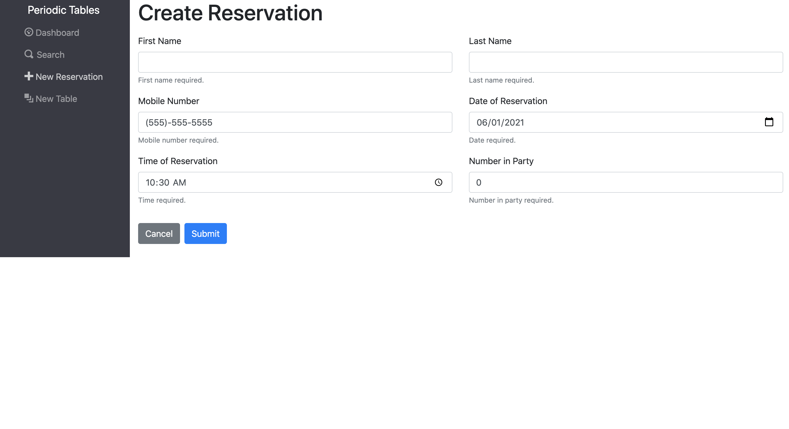
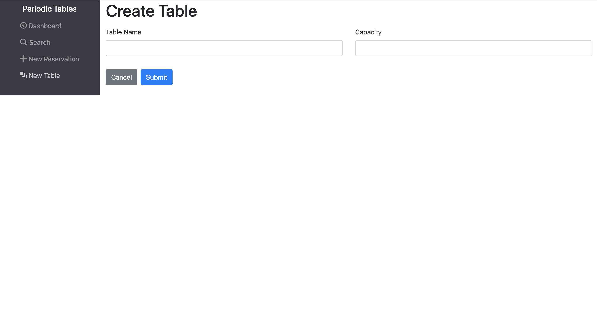
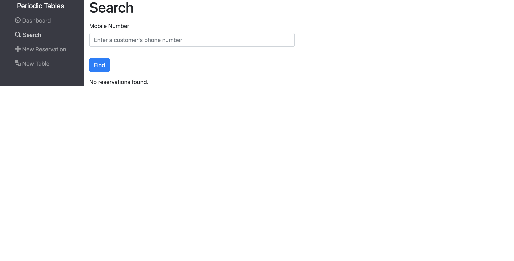

# Capstone: Restaurant Reservation System

> This project was my final capstone in the Thinkful Engineering Flex Program.

## Project Description

> You have been hired as a full stack developer at _Periodic Tables_, a startup that is creating a reservation system for fine dining restaurants.
> The software is used only by restaurant personnel when a customer calls to request a reservation.
> At this point, the customers will not access the system online.

## Built With

- React.js
- Bootstrap
- CSS
- JSX
- Javascript
- Express
- Knex
- PostgreSQL
- Node.js
- CORS

## Deployment

- [Periodic Tables - client](https://restaurant-reservation-client-e6jfxoqz7-smabbett.vercel.app/dashboard)
- [Periodic Tables - server](https://restaurant-reservation-client-e6jfxoqz7-smabbett.vercel.app/dashboard)

### API Paths

| API path                               | Function                                                                                                        |
| -------------------------------------- | --------------------------------------------------------------------------------------------------------------- |
| `/reservations`                        | GET: List all reservations. POST: Create a new reservation                                                      |
| `/reservations/?date='YYYY-MM-DD'`     | GET: All reservations by date (formated YYYY-MM-DD) ordered by reservation_time                                 |
| `/reservations/:reservation_id`        | GET: A reservation by reservation_id, PUT: Update a reservation by reservation_id, DELETE: Delete a reservation |
| `/reservations/:reservation_id/status` | PUT: Update a reservation status as either "booked", "seated", "finished", or "cancelled"                       |
| `/tables`                              | GET: List all tables, POST: Create a new table                                                                  |
| `/tables/:tables_id`                   | GET: A table by table_id, PUT: Update a table, DELETE: Delete a table                                           |
| `/tables:table_id/seat`                | PUT: Update a table's status to "Occupied" DELETE: Update a table's status to "Free"                            |

## Dashboard

## Table Seating

## Dashboard with seated table

## Create Reservation

## Create Table

## Search by Phone Number

## Project Requirements

The Product Manager has already created the user stories for _Periodic Tables_. Each of the user stories is listed below, and your Product Manager wants them to be implemented in the order in which they are listed. Another developer has already written the tests for each of the user stories so that you don't have to.

### US-01 Create and list reservations

As a restaurant manager 
I want to create a new reservation when a customer calls 
so that I know how many customers will arrive at the restaurant on a given day.

### US-02 Create reservation on a future, working date

As a restaurant manager 
I only want to allow reservations to be created on a day when we are open 
so that users do not accidentally create a reservation for days when we are closed. 

### US-03 Create reservation within eligible timeframe

As a restaurant manager 
I only want to allow reservations to be created during business hours, up to 60 minutes before closing 
so that users do not accidentally create a reservation for a time we cannot accommodate.

### US-04 Seat reservation

As a restaurant manager,  
When a customer with an existing reservation arrives at the restaurant 
I want to seat (assign) their reservation to a specific table 
so that I know which tables are occupied and free.

### US-05 Finish an occupied table

As a restaurant manager 
I want to free up an occupied table when the guests leave 
so that I can seat new guests at that table. 

### US-06 Reservation Status

As a restaurant manager 
I want a reservation to have a status of either booked, seated, or finished 
so that I can see which reservation parties are seated, and finished reservations are hidden from the dashboard.

### US-07 Search for a reservation by phone number

As a restaurant manager 
I want to search for a reservation by phone number (partial or complete) 
so that I can quickly access a customer's reservation when they call about their reservation. 

### US-08 Change an existing reservation

As a restaurant manager 
I want to be able to modify a reservation if a customer calls to change or cancel their reservation 
so that reservations are accurate and current.

## Installation

1. Fork and clone this repository.
1. Run `cp ./back-end/.env.sample ./back-end/.env`.
1. Update the `./back-end/.env` file with the connection URL's to your ElephantSQL database instance.
1. Run `cp ./front-end/.env.sample ./front-end/.env`.
1. You should not need to make changes to the `./front-end/.env` file unless you want to connect to a backend at a location other than `http://localhost:5000`.
1. Run `npm install` to install project dependencies.
1. Run `npm run start:dev` to start your server in development mode.
